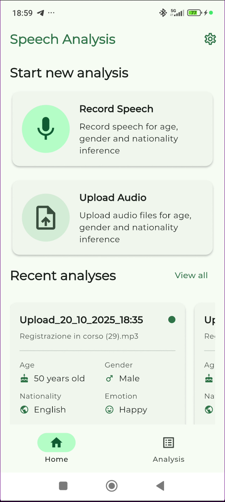
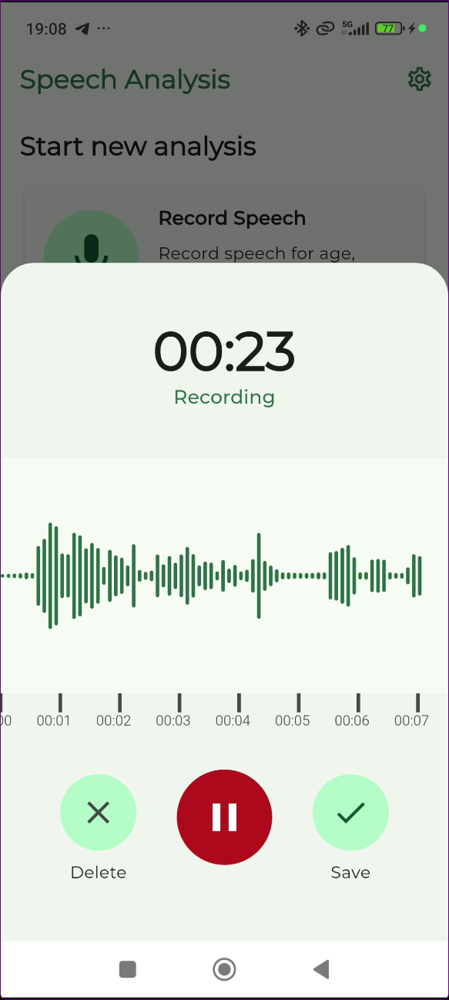
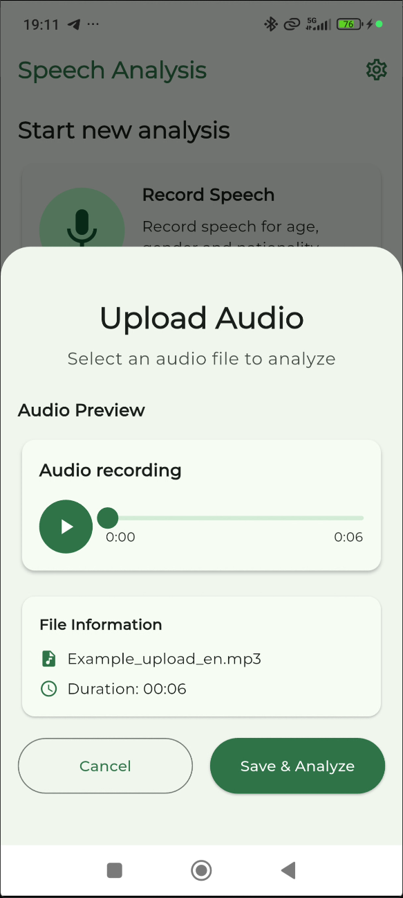
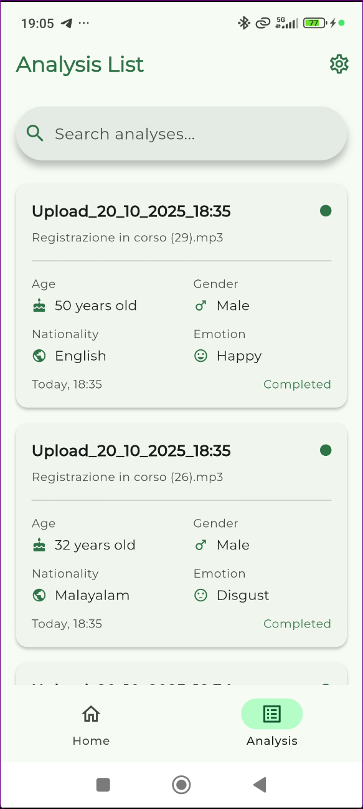
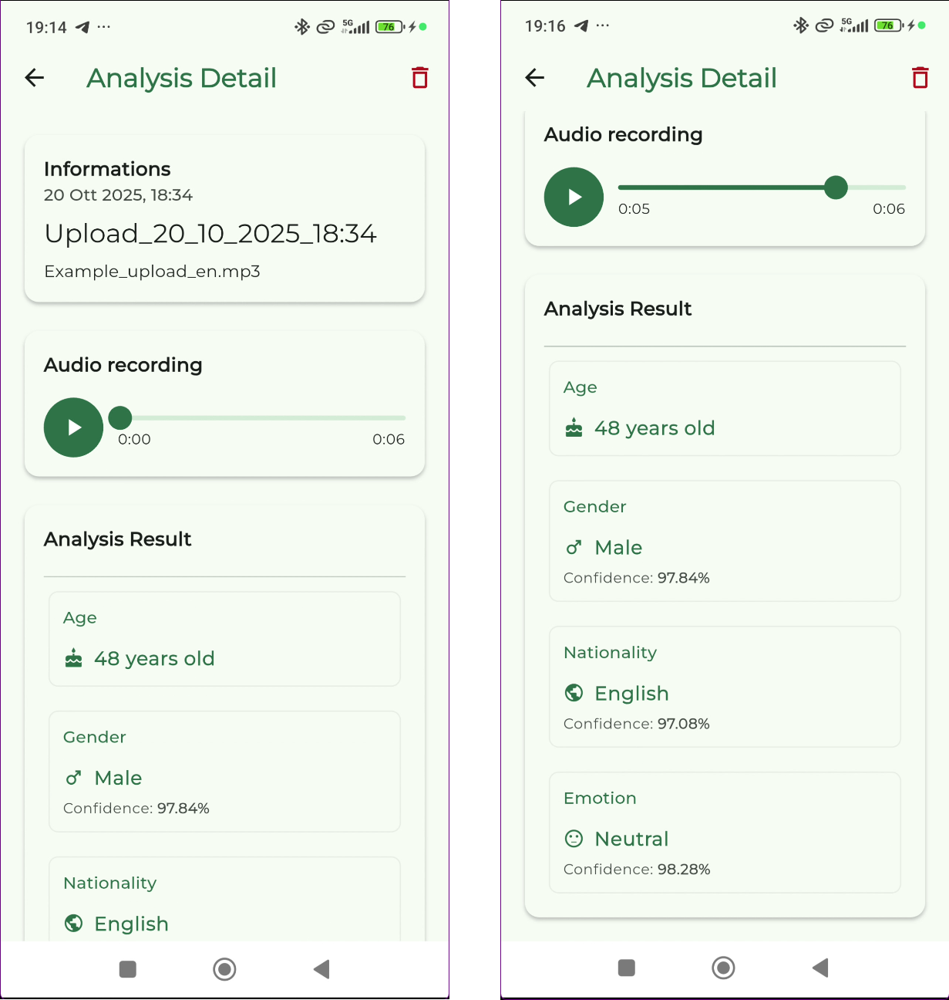

#  Speech Analysis

An Android application written in Flutter for analyzing speech audio to predict **age**, **gender**, **nationality**, and **emotion** using on-device AI inference with ONNX Runtime.

---

## App Screenshots

<div style="display: flex; justify-content: space-between; margin: 20px 0;">

### Home Screen


The main interface provides two options for audio input: record speech directly (up to 30 seconds) or upload existing audio files. Recent analyses are displayed at the bottom for quick access to previous results.

### Audio Recording


Real-time audio recording with visual waveform feedback. The recording interface includes a timer, pause/resume functionality, and options to save or discard the recording before analysis.

### Audio Upload


Upload existing audio files (MP3, WAV, M4A) with preview playback and file information display. The interface shows audio duration and allows users to review the file before proceeding with analysis.

### Analysis List


Browse and search through all past analyses with summary cards showing key results (age, gender, nationality, emotion) and timestamps. Quick access to detailed results with a single tap.

### Analysis Details


Comprehensive analysis results displaying predicted age, gender with confidence scores, detected language, and emotional state. Includes audio playback functionality and the ability to delete individual analyses.

</div>


## Demo Videos


https://github.com/user-attachments/assets/66e00e37-cb2b-4ea5-a4a4-3ee95602ee19

https://github.com/user-attachments/assets/0276574b-fd62-4fa4-9cf7-c76cf614fa96


## Features

### Mobile App (Flutter)
- **Record Audio**: Record speech directly within the app (30-second limit)
- **Upload Audio**: Upload existing audio files (MP3, WAV, M4A)
- **On-Device Analysis**: Local inference using ONNX Runtime - no data leaves the device
- **Analysis History**: Browse and manage past analyses
- **Audio Playback**: Built-in audio player for recorded/uploaded files
- **Offline Storage**: Local SQLite database for analysis history
- **Dark/Light Themes**: Multiple theme options with accessibility support

### AI Models (Local Inference)
- **Age Prediction**: Regression model for age estimation (0-100 years)
- **Gender Classification**: Multi-class classification (Male/Female/Child)
- **Language/Nationality Detection**: 99+ language identification using Whisper
- **Emotion Recognition**: 8-emotion classification (angry, happy, sad, neutral, etc.)

---

## Model Evaluation

Comprehensive evaluation scripts for all models are available in the `scripts/` directory:

### Available Evaluation Scripts

#### **Age & Gender Model**
- **Documentation**: [<u>age and gender test documentation.md</u>](scripts/age%20gender%20script%20evaluation/age%20and%20gender%20test%20documentation.md)
- **Dataset**: Mozilla Common Voice (German, 1,110 samples)
- **Results**:
  - Gender Accuracy: **96.3%**
  - Age MAE: **10.55 years**

#### **Emotion Recognition Model**
- **Documentation**: [<u>emotion test documentation.md</u>](scripts/emotion%20script%20evaluation/emotion%20test%20documentation.md)
- **Dataset**: SSI Speech Emotion Recognition (1,999 samples)
- **Results**:
  - Overall Accuracy: **82.14%**
  - Best emotions: Surprised (94.8%), Angry (88.1%)

#### **Whisper Language Identification**
- **Documentation**: [<u>whisper test documentation.md</u>](scripts/whisper%20script%20evaluation/whisper%20test%20documentation.md)
- **Dataset**: FLEURS (63,344 samples, 82 languages)
- **Results**:
  - 82-Language Accuracy: **55.97%**
  - Top languages: Mandarin Chinese (93.6%), Vietnamese (92.2%)

### Evaluation Features

Each evaluation script includes:
- Automatic dataset download from Hugging Face
-  Comprehensive metrics (accuracy, precision, recall, F1-score)
-  Confusion matrices and performance visualizations
-  Detailed per-class results
-  Comparison with original paper results
-  Resume functionality for long evaluations

---

## Model Citations

This project uses pre-trained models from Hugging Face:

### Age & Gender Recognition
**audeering/wav2vec2-large-robust-6-ft-age-gender**  
- Repository: https://huggingface.co/audeering/wav2vec2-large-robust-6-ft-age-gender
- Fine-tuned Wav2Vec2 model for age and gender prediction from speech
- License: CC-BY-4.0

### Emotion Recognition  
**prithivMLmods/Speech-Emotion-Classification**
- Repository: https://huggingface.co/prithivMLmods/Speech-Emotion-Classification  
- Wav2Vec2 model fine-tuned for emotion classification
- Supports 8 emotion classes: angry, calm, disgust, fearful, happy, neutral, sad, surprised

### Language Detection
**openai/whisper-tiny**
- Repository: https://huggingface.co/openai/whisper-tiny
- Lightweight Whisper model for multilingual speech recognition and language identification
- Supports 99+ languages with high accuracy
- License: MIT

---

## Prerequisites

### For Flutter App
- Flutter SDK 3.7.2 or higher
- Dart SDK
- Android Studio / Xcode (for mobile development)
- Android device or emulator

### For Evaluation Scripts
- Python 3.8+
- See individual evaluation README files for dependencies

### System Requirements
- **Mobile**: Android 7.0+ (API 24+) or iOS 12.0+
- **Storage**: ~500MB for models and app data
- **RAM**: 4GB+ recommended for optimal performance

---

## Build and deployment

### 1. Clone Repository
```bash
git clone <repository-url>
cd speech-analysis-app
```

### 2. Navigate to Flutter Directory
```bash
cd flutter_app
```

### 3. Install Flutter Dependencies
```bash
flutter pub get
```

### 4. Download Model Assets
The ONNX models are stored using Git LFS. Ensure you have Git LFS installed:
```bash
git lfs pull
```

### 5. Run Flutter App
```bash
# Check connected devices
flutter devices

# Run on connected device/emulator
flutter run

# Or specify platform
flutter run -d android
```

---

## Technical Details

### Audio Processing Pipeline
1. **Input**: Record (30s max) or upload audio file (MP3, WAV, M4A)
2. **Preprocessing**: FFmpeg conversion to 16kHz mono PCM
3. **Feature Extraction**: Wav2Vec2 feature encoding
4. **Inference**: ONNX Runtime model execution
5. **Results**: Age, gender, language, and emotion predictions

### Model Performance

Performance metrics based on comprehensive evaluations (see `evaluation_scripts/` for details):

| Model | Metric | Value | Dataset | Samples |
|-------|--------|-------|---------|---------|
| **Age Prediction** | MAE | 10.55 years | CommonVoice (de) | 1,110 |
| **Gender Classification** | Accuracy | 96.3% | CommonVoice (de) | 1,110 |
| **Language Detection** | Accuracy | 55.97% | FLEURS | 63,344 |
| **Emotion Recognition** | Accuracy | 82.14% | SSI | 1,999 |

### Quantization Impact

Emotion and Age and Gender models are quantized to INT8 for mobile deployment:
- **Model size reduction**: ~93% (FP32 → INT8)
- **Inference speed**: 2-7 seconds per sample (on-device)
- **Accuracy trade-off**: Minimal degradation (1.5-3% typical)

---

## License

This project is licensed under the MIT License. See individual model repositories for their respective licenses.

---

## Acknowledgments

- **Hugging Face** for providing pre-trained models
- **ONNX Runtime** for cross-platform inference
- **Flutter** for the mobile framework
- **Mozilla Common Voice**, **Google FLEURS**, and **SSI** for evaluation datasets
